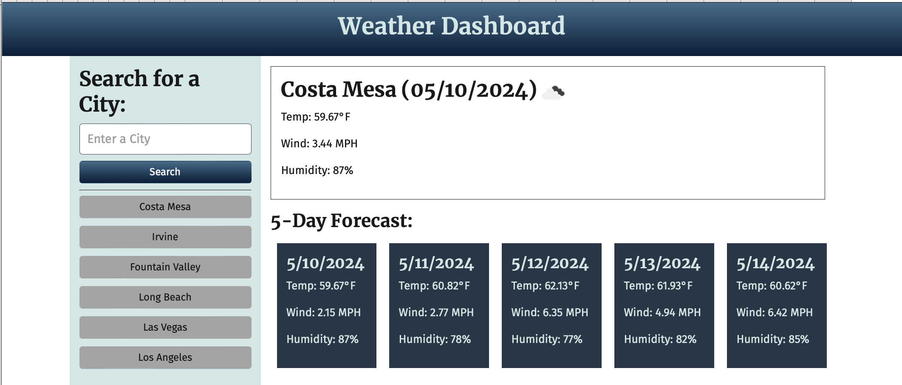

# 06-Server-Side-APIs-Weather-Dashboard

## Description

This weather dashboard retrieves data from [5 Day Weather Forecast's APIs](https://openweathermap.org/forecast5), and uses HTML and CSS to dynamically render the current and future weather conditions of the cities in search to the user's browser.

## User Story

```
AS A traveler
I WANT to see the weather outlook for multiple cities
SO THAT I can plan a trip accordingly
```

## Acceptance Criteria

```
GIVEN a weather dashboard with form inputs

1. WHEN I search for a city
THEN I am presented with current and future conditions for that city and that city is added to the search history.

2. WHEN I view current weather conditions for that city
THEN I am presented with the city name, the date, an icon representation of weather conditions, the temperature, the humidity, and the wind speed.

3. WHEN I view future weather conditions for that city
THEN I am presented with a 5-day forecast that displays the date, an icon representation of weather conditions, the temperature, the wind speed, and the humidity.

4. WHEN I click on a city in the search history
THEN I am again presented with current and future conditions for that city.
```

## Mock-Up

The following image shows the web application's appearance and functionality:



## Link to app

To visit my weather dashboard please click: [https://ngojohn2002.github.io/06-Server-Side-APIs-Weather-Dashboard/](https://ngojohn2002.github.io/06-Server-Side-APIs-Weather-Dashboard/)
  

&copy; 2024 - All Right Reserved.